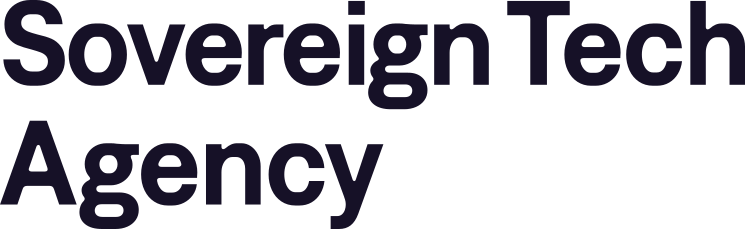

<!--
SPDX-License-Identifier: AGPL-3.0-or-later
SPDX-FileCopyrightText: 2026 Mohammad Mahdi Baghbani Pourvahid <mahdi-baghbani@azadehafzar.io>

OpenCloudMesh Go - a runnable Open Cloud Mesh peer in Go, focused on a strict, WebDAV-centered subset of the protocol.
-->

# OpenCloudMesh Go

> A runnable Open Cloud Mesh peer in Go, focused on a strict, WebDAV-centered
> subset of the protocol.

[](https://deepwiki.com/MahdiBaghbani/opencloudmesh-go)
[](LICENSE)

OpenCloudMesh Go is a Go server for Open Cloud Mesh (OCM). It focuses on a
pinned, practical slice of the protocol: discovery, user shares, invite flows,
the strict authorization-code flow, HTTP signatures and JWKS, and Bearer
WebDAV access on that path.

This repository is not the OCM specification itself, and it does not claim full
OCM-API coverage or broad compatibility with arbitrary peers. What it does try
to offer is narrower and more useful: a documented strict contract, a pinned
spec snapshot, and a real server you can run, test, and extend.

Status: active development. The strict contract is the part that is supported
and tested on every change; expect the edges outside it to keep moving.

## Why OpenCloudMesh Go

When a discovery stub is not enough, you usually want a real peer you can talk
to, a clear idea of what "strict" means, and a codebase that does not hide the
interesting parts behind magic. That is what this repo is trying to be.

It gives you a runnable OCM peer in Go, keeps the scope explicit instead of
pretending to implement everything, and pins behavior to a specific OCM-API
snapshot. It also tries to make the security story legible: signatures,
transport, and trust are deliberate knobs rather than
silent fallbacks.

Right now that means discovery, user-share flows on the WebDAV-centered path,
invite handling, accept flows, optional WAYF support, the strict
authorization-code flow on the documented OCM route surface, and a bundled UI
and API for practical local and multi-instance workflows.

For the exact route surface, start with
[docs/protocol-endpoints.md](docs/protocol-endpoints.md) and
[docs/discovery.md](docs/discovery.md).

## Who it is for

You will probably get the most out of this if you are building or testing OCM
peers and want something concrete to talk to, if you are studying how a
signature-aware, WebDAV-centered OCM flow actually fits together, or if you need
a Go server whose scope and guarantees are written down rather than implied. If
you are looking for a full, drop-in OCM implementation that federates with every
peer out there, this is not that yet, and it is honest about it.

## What passing tests mean

The repo ships unit tests, architecture guard tests, integration tests, and
optional Playwright E2E flows. They matter, but they do not all prove the same
thing, and this README should not pretend otherwise.

The narrow contract this repo stands behind lives in
[docs/verification-boundary.md](docs/verification-boundary.md). If you want to
know what a green strict run actually proves, what remains operator-managed,
and what this project does not claim about arbitrary peers, read that file
first.

## Quickstart

From the repo root:

```sh
# Build the server binary
make build

# Run unit and integration tests
make test

# Start the server in strict mode (default)
./bin/opencloudmesh-go

# Check discovery
curl http://localhost:9200/.well-known/ocm
```

Useful local variants:

```sh
# Dev preset
./bin/opencloudmesh-go -mode dev

# Strict preset with a TOML file
./bin/opencloudmesh-go -config docker/configs/config-tls.toml

# Override from the CLI
./bin/opencloudmesh-go -mode strict -public-origin https://localhost:9200
```

## See it work

The quickest way to watch two peers talk is the bundled two-instance runner. It
builds the binary and starts a sender and a receiver side by side:

```sh
./scripts/dev/two-instance.sh
```

That gives you a sender on `http://localhost:9200` and a receiver on
`http://localhost:9201`, both ready for a local share flow. Hit Ctrl+C to stop
both. From there you can open discovery on each, or drive an invite and accept
between them.

## Presets and configuration

The server resolves config in this order: preset bundle, TOML file, CLI flags.

The shipped preset bundles are `strict` and `dev`. They are good starting
points; effective behavior also depends on signature, transport, and trust
settings.

If you are getting oriented, start here:

- [docs/configuration.md](docs/configuration.md)
- [docs/identity-and-public-origin.md](docs/identity-and-public-origin.md)
- [docs/routes-and-auth.md](docs/routes-and-auth.md)

Useful sample configs:

- `docker/configs/config.toml` for a minimal container-oriented dev setup
- `docker/configs/config-tls.toml` for a strict setup with static TLS
- `tests/ca_pool/configs/valid.toml` and `invalid.toml` for outbound root CA
  validation

## Documentation

### Core docs

- [docs/architecture.md](docs/architecture.md)
- [docs/repo-layout.md](docs/repo-layout.md)
- [docs/development.md](docs/development.md)
- [docs/testing.md](docs/testing.md)

### Protocol and runtime behavior

- [docs/protocol-endpoints.md](docs/protocol-endpoints.md)
- [docs/discovery.md](docs/discovery.md)
- [docs/invite-wayf-and-accept.md](docs/invite-wayf-and-accept.md)
- [docs/directory-service-and-ocm-aux.md](docs/directory-service-and-ocm-aux.md)
- [docs/outbound-http-ssrf.md](docs/outbound-http-ssrf.md)
- [docs/verification-boundary.md](docs/verification-boundary.md)

### Test guides

- [tests/integration/README.md](tests/integration/README.md)
- [tests/e2e/README.md](tests/e2e/README.md)
- [tests/ca_pool/README.md](tests/ca_pool/README.md)

## Repo navigation

```text
cmd/opencloudmesh-go/     Binary entrypoint
internal/                 Production and test-support code
  architecture/           Architecture guard tests
  components/             Domain logic (ocm, api, identity, ...)
  frameworks/             Service registry and startup
  interceptors/           HTTP middleware (ratelimit, ...)
  platform/               Config, HTTP, cache, store, repos
  services/               HTTP route handlers
  testsupport/            Test-only helpers (not for production)
  wiring/                 Composition root
tests/                    Integration, E2E, and CA pool tests
docs/                     Developer and protocol documentation
docker/                   Container image and sample configs
```

See [docs/repo-layout.md](docs/repo-layout.md) for the full map.

## Build and test

```sh
make build
make test-go
make test-integration
make test
make test-e2e-install
make test-e2e
make fmt
make vet
make tidy
```

`make test` runs unit and integration tests. E2E stays separate because it
needs Bun, Playwright, and a built binary.

## Docker

Build the local image:

```sh
./scripts/build-docker.sh
# or: docker build -t opencloudmesh-go:local -f docker/Dockerfile .
```

Run in HTTP mode:

```sh
docker run -d -p 8080:8080 -e HOST=ocm-go1 opencloudmesh-go:local
curl http://localhost:8080/.well-known/ocm
```

Run in TLS mode with the pre-installed certs:

```sh
docker run -d -p 443:443 -e HOST=ocm-go1 -e TLS_ENABLED=true opencloudmesh-go:local
curl -k https://localhost/.well-known/ocm
```

Set at least one of `HOST` or `PUBLIC_ORIGIN`. The full environment-variable
reference, including TLS material and how the entrypoint derives the public
origin, lives in [docs/docker.md](docs/docker.md).

## DeepWiki

If you want a browsable, AI-generated overview of the repository, see
[DeepWiki](https://deepwiki.com/MahdiBaghbani/opencloudmesh-go). The files
under [`docs/`](docs/) are still the source of truth.

## Ecosystem

OpenCloudMesh Go sits in the middle of the wider OCM stack. The protocol lives
in [cs3org/OCM-API](https://github.com/cs3org/OCM-API). This repo provides a
runnable Go server for a focused OCM slice, and downstream container and
interoperability setups use it alongside the wider OCM image and test tooling.

Protocol behavior is pinned to the OCM-API snapshot at
[`6a0586183cbef10ecae9dedc42561806447eb2f5`](https://github.com/cs3org/OCM-API/blob/6a0586183cbef10ecae9dedc42561806447eb2f5/IETF-OCM.md),
with the vendored pin recorded in `internal/components/ocm/spec/vendor/pin.json`.

## Acknowledgements

OpenCloudMesh Go exists because someone chose to fund open source
infrastructure. A big thank you to the Sovereign Tech Agency for backing this
work, which Mahdi Baghbani develops as part of Open Cloud Mesh.

<p>
  <a href="https://www.sovereign.tech/tech/open-cloud-mesh">
    
  </a>
</p>

You can read the full story in [FUNDING.md](FUNDING.md).

## Contributing

Contributions are welcome. See [CONTRIBUTING.md](./CONTRIBUTING.md) for the
development workflow, validation commands, and pull request expectations.

## Questions and issues

Bug reports, questions, and ideas are welcome on the
[issue tracker](https://github.com/MahdiBaghbani/opencloudmesh-go/issues). If
something in the docs is unclear or wrong, that is worth an issue too.

## License

Licensed under the GNU Affero General Public License v3.0 or later
(AGPL-3.0-or-later). See [LICENSE](LICENSE).
